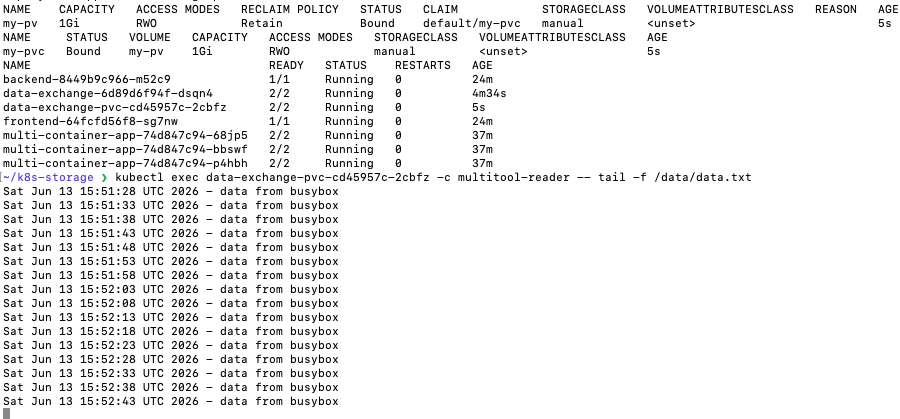
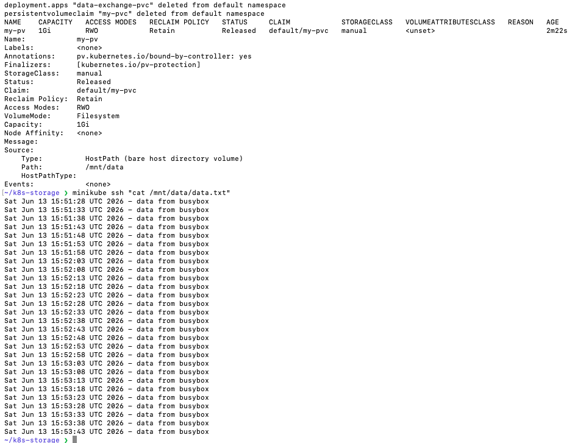
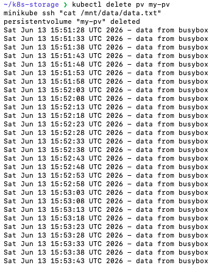
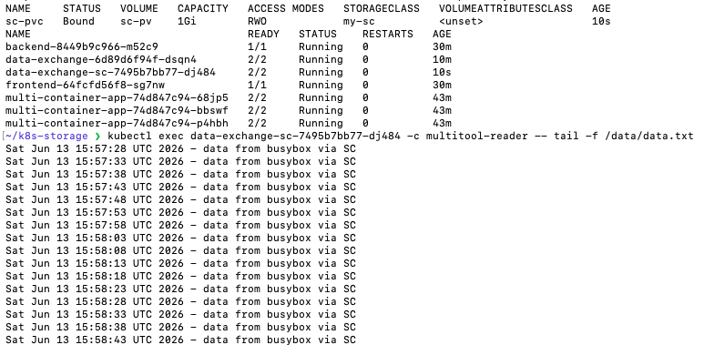

# Домашнее задание к занятию «Хранение в K8s» Савкин ИН

---

## Задание 1. Volume: обмен данными между контейнерами в поде

### Манифест (containers-data-exchange.yaml)

```yaml
apiVersion: apps/v1
kind: Deployment
metadata:
  name: data-exchange
spec:
  replicas: 1
  selector:
    matchLabels:
      app: data-exchange
  template:
    metadata:
      labels:
        app: data-exchange
    spec:
      containers:
      - name: busybox-writer
        image: busybox
        command: ["/bin/sh", "-c"]
        args:
        - while true; do
            echo "$(date) - data from busybox" >> /shared/data.txt;
            sleep 5;
          done
        volumeMounts:
        - name: shared-data
          mountPath: /shared
      - name: multitool-reader
        image: wbitt/network-multitool
        command: ["/bin/sh", "-c"]
        args:
        - tail -f /shared/data.txt
        volumeMounts:
        - name: shared-data
          mountPath: /shared
      volumes:
      - name: shared-data
        emptyDir: {}
```

### Скриншот описания пода и чтения файла

Оба контейнера монтируют общий `emptyDir` volume `/shared`. Контейнер `busybox-writer` пишет в файл каждые 5 секунд, `multitool-reader` читает через `tail -f`:



---

## Задание 2. PV, PVC

### Манифест (pv-pvc.yaml)

```yaml
apiVersion: v1
kind: PersistentVolume
metadata:
  name: my-pv
spec:
  capacity:
    storage: 1Gi
  volumeMode: Filesystem
  accessModes:
    - ReadWriteOnce
  persistentVolumeReclaimPolicy: Retain
  storageClassName: manual
  hostPath:
    path: /mnt/data
---
apiVersion: v1
kind: PersistentVolumeClaim
metadata:
  name: my-pvc
spec:
  volumeName: my-pv
  volumeMode: Filesystem
  accessModes:
    - ReadWriteOnce
  storageClassName: manual
  resources:
    requests:
      storage: 500Mi
---
apiVersion: apps/v1
kind: Deployment
metadata:
  name: data-exchange-pvc
spec:
  replicas: 1
  selector:
    matchLabels:
      app: data-exchange-pvc
  template:
    metadata:
      labels:
        app: data-exchange-pvc
    spec:
      containers:
      - name: busybox-writer
        image: busybox
        command: ["/bin/sh", "-c"]
        args:
        - while true; do
            echo "$(date) - data from busybox" >> /data/data.txt;
            sleep 5;
          done
        volumeMounts:
        - name: pvc-storage
          mountPath: /data
      - name: multitool-reader
        image: wbitt/network-multitool
        command: ["/bin/sh", "-c"]
        args:
        - tail -f /data/data.txt
        volumeMounts:
        - name: pvc-storage
          mountPath: /data
      volumes:
      - name: pvc-storage
        persistentVolumeClaim:
          claimName: my-pvc
```

### Шаг 2. PV и PVC созданы, под запущен, данные читаются



### Шаг 3. Удаление Deployment и PVC — что стало с PV

```bash
kubectl delete deployment data-exchange-pvc
kubectl delete pvc my-pvc
kubectl get pv
kubectl describe pv my-pv
```


**Объяснение:** После удаления PVC статус PV изменился с `Bound` на `Released`. PV **не удалился** автоматически, потому что у него установлена политика `persistentVolumeReclaimPolicy: Retain`. Это означает что Kubernetes сохраняет PV и данные на диске даже после удаления PVC — администратор должен удалить PV вручную.

### Шаг 4. Файл сохранился на диске после удаления PV

```bash
kubectl delete pv my-pv
minikube ssh "cat /mnt/data/data.txt"
```



**Объяснение:** После удаления PV файл `/mnt/data/data.txt` **остался на диске ноды**. PV — это лишь Kubernetes-объект, описывающий хранилище. Его удаление не затрагивает физические данные на диске. Политика `Retain` гарантирует сохранность данных при любых операциях с Kubernetes-объектами.

---

## Задание 3. StorageClass

### Манифест (sc.yaml)

```yaml
apiVersion: storage.k8s.io/v1
kind: StorageClass
metadata:
  name: my-sc
provisioner: kubernetes.io/no-provisioner
volumeBindingMode: WaitForFirstConsumer
---
apiVersion: v1
kind: PersistentVolume
metadata:
  name: sc-pv
spec:
  capacity:
    storage: 1Gi
  volumeMode: Filesystem
  accessModes:
    - ReadWriteOnce
  persistentVolumeReclaimPolicy: Retain
  storageClassName: my-sc
  hostPath:
    path: /mnt/sc-data
---
apiVersion: v1
kind: PersistentVolumeClaim
metadata:
  name: sc-pvc
spec:
  volumeMode: Filesystem
  accessModes:
    - ReadWriteOnce
  storageClassName: my-sc
  resources:
    requests:
      storage: 500Mi
---
apiVersion: apps/v1
kind: Deployment
metadata:
  name: data-exchange-sc
spec:
  replicas: 1
  selector:
    matchLabels:
      app: data-exchange-sc
  template:
    metadata:
      labels:
        app: data-exchange-sc
    spec:
      containers:
      - name: busybox-writer
        image: busybox
        command: ["/bin/sh", "-c"]
        args:
        - while true; do
            echo "$(date) - data from busybox via SC" >> /data/data.txt;
            sleep 5;
          done
        volumeMounts:
        - name: sc-storage
          mountPath: /data
      - name: multitool-reader
        image: wbitt/network-multitool
        command: ["/bin/sh", "-c"]
        args:
        - tail -f /data/data.txt
        volumeMounts:
        - name: sc-storage
          mountPath: /data
      volumes:
      - name: sc-storage
        persistentVolumeClaim:
          claimName: sc-pvc
```

### Шаг 2-3. SC и PVC созданы, данные читаются через StorageClass


